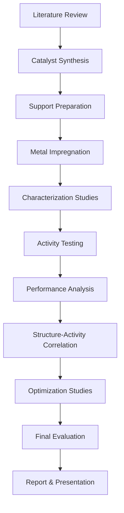

# ⚗️ Different Silica Supports Catalyst Synthesis for Hydrodesulfurization

<div align="center">


*Advanced catalyst development for cleaner fuel production through innovative silica support systems*

[](https://github.com/Bhavishya-Gupta)
[](https://che.iitk.ac.in/)
[](https://en.wikipedia.org/wiki/Catalysis)
[](UGP_REPORT_BHAVISHYA_220295.pdf)

[📊 Research Overview](#-research-overview) • [🧪 Methodology](#-methodology) • [📈 Results](#-results-performance) • [📚 Documentation](#-project-documentation)

</div>

---

## 📋 Table of Contents

- [Research Overview](#-research-overview)
- [Project Significance](#-project-significance)
- [Catalyst Systems](#-catalyst-systems-studied)
- [Methodology](#-methodology)
- [Experimental Design](#-experimental-design)
- [Results & Performance](#-results--performance)
- [Technical Implementation](#-technical-implementation)
- [Project Documentation](#-project-documentation)
- [Literature Foundation](#-literature-foundation)
- [Future Research](#-future-research-directions)
- [Industrial Applications](#-industrial-applications)
- [Acknowledgments](#-acknowledgments)

---

## 🎯 Research Overview

**Hydrodesulfurization (HDS) Catalyst Development** is a critical research area in petroleum refining focused on removing sulfur compounds from crude oil fractions to produce cleaner fuels. This undergraduate research project investigates the synthesis and performance evaluation of **Ni–Mo catalysts** supported on amorphous Al₂O₃ blended with different silica supports for enhanced hydrodesulfurization activity.

### 🔍 Problem Statement

Modern environmental regulations demand:
- **Ultra-low sulfur fuels** (< 10 ppm sulfur content)
- **Enhanced catalyst activity** for refractory sulfur compounds
- **Cost-effective catalyst systems** for industrial applications
- **Improved catalyst stability** under harsh operating conditions

### 💡 Research Objectives

This project addresses these challenges by:
- **Developing novel catalyst supports** using different silica materials
- **Optimizing catalyst synthesis** methods for enhanced performance
- **Evaluating HDS activity** against refractory compounds like dibenzothiophene
- **Characterizing catalyst properties** through advanced analytical techniques

### 🌍 Environmental Impact

- **Reduced sulfur emissions** from transportation fuels
- **Cleaner combustion** leading to lower air pollution
- **Enhanced fuel quality** meeting stringent environmental standards
- **Sustainable catalyst development** for green chemistry applications

---

## 🏆 Project Significance

### 🔬 Scientific Contribution

This research contributes to the field through:
- **Novel support systems** combining Al₂O₃ with advanced silica materials
- **Comparative analysis** of different mesoporous silica supports
- **Structure-activity relationships** in HDS catalysis
- **Optimization strategies** for catalyst synthesis parameters

### 📊 Industrial Relevance

Key industrial implications include:
- **Improved refinery efficiency** through better catalyst performance
- **Cost reduction** in desulfurization processes
- **Extended catalyst lifetime** reducing replacement frequency
- **Enhanced product quality** meeting fuel specifications

### 🎓 Academic Excellence

This undergraduate project demonstrates:
- **Advanced research methodology** in catalysis
- **Comprehensive experimental design** and execution
- **Professional documentation** and presentation skills
- **Critical analysis** of experimental results

---

## ⚗️ Catalyst Systems Studied

### 🧱 Support Materials Investigated

| Support System | Structure Type | Key Properties | Expected Benefits |
|----------------|----------------|----------------|-------------------|
| **MCM-41** | Mesoporous Silica | Hexagonal pore structure, high surface area | Enhanced dispersion, improved accessibility |
| **SBA-15** | Mesoporous Silica | Large pore size, thick walls | High stability, excellent mass transfer |
| **KIT-6** | Mesoporous Silica | 3D bicontinuous structure | Superior diffusion, multiple pathways |
| **SiO₂** | Amorphous Silica | Conventional support | Baseline comparison, cost-effective |
| **Al₂O₃** | Amorphous Alumina | High surface area, acidic sites | Traditional HDS support, proven performance |

### 🔬 Active Metal System

**Ni–Mo Bimetallic Catalyst**
- **Primary Active Metal**: Molybdenum (Mo) - main HDS active phase
- **Promoter Metal**: Nickel (Ni) - enhances Mo sulfidation and activity
- **Synergistic Effect**: Ni-Mo-S phase formation for optimal HDS performance
- **Loading Optimization**: Systematic variation of metal concentrations

### ⚡ Target Compound

**Dibenzothiophene (DBT)**
- **Chemical Formula**: C₁₂H₈S
- **Significance**: Representative refractory sulfur compound
- **Industrial Relevance**: Most difficult sulfur compound to remove
- **Reaction Pathway**: Direct desulfurization (DDS) vs. hydrogenation (HYD)

---

## 🧪 Methodology

### 1. 🏭 Catalyst Synthesis Protocol

#### Support Preparation
```
Step 1: Silica Support Synthesis
├── MCM-41: Surfactant templating method
├── SBA-15: Triblock copolymer template
├── KIT-6: Dual surfactant approach  
└── SiO₂: Sol-gel precipitation

Step 2: Support Blending
├── Al₂O₃ : Silica ratio optimization
├── Physical mixing procedures
└── Calcination protocols
```

#### Active Metal Impregnation
```
Step 3: Metal Loading
├── Incipient wetness impregnation
├── Sequential vs. co-impregnation
├── Precursor solutions preparation
└── Drying and calcination cycles

Step 4: Catalyst Activation
├── Sulfidation pretreatment
├── Temperature programming
├── H₂S/H₂ atmosphere
└── Activity stabilization
```

### 2. 🔬 Characterization Techniques

| Technique | Purpose | Information Obtained |
|-----------|---------|---------------------|
| **BET Surface Area** | Textural properties | Surface area, pore volume, pore size distribution |
| **XRD Analysis** | Crystalline phases | Phase identification, crystallite size |
| **SEM/TEM** | Morphological studies | Particle size, shape, dispersion |
| **TPR Analysis** | Reducibility | Metal-support interactions, reduction behavior |
| **XPS Spectroscopy** | Surface composition | Oxidation states, surface enrichment |
| **ICP-AES** | Elemental analysis | Actual metal loading verification |

### 3. ⚙️ Activity Evaluation

#### Reaction Conditions
- **Temperature**: 300-400°C
- **Pressure**: 30-50 bar
- **H₂/HC Ratio**: 300-500 NL/L
- **LHSV**: 1-4 h⁻¹
- **Feed**: DBT in n-decane (500-1000 ppm S)

#### Performance Metrics
- **Conversion (%)**: \( X = \frac{C_0 - C}{C_0} \times 100 \)
- **Rate Constant**: \( k = -\ln(1-X) \times LHSV \)
- **Selectivity**: Product distribution analysis
- **Catalyst Stability**: Time-on-stream studies

---

## 🏗️ Experimental Design

### Research Methodology Framework



### 📊 Experimental Matrix

| Variable | Levels | Rationale |
|----------|--------|-----------|
| **Support Type** | 4 types (MCM-41, SBA-15, KIT-6, SiO₂) | Compare different pore structures |
| **Al₂O₃ Blend Ratio** | 3 levels (70:30, 50:50, 30:70) | Optimize support composition |
| **Metal Loading** | 3 levels (Low, Medium, High) | Determine optimal concentration |
| **Calcination Temperature** | 3 levels (450°C, 500°C, 550°C) | Study thermal effects |
| **Reaction Temperature** | 3 levels (320°C, 350°C, 380°C) | Activity vs. temperature |

### 🎯 Key Performance Indicators

1. **Catalytic Activity**: DBT conversion rates
2. **Selectivity**: Product distribution (biphenyl vs. cyclohexylbenzene)
3. **Stability**: Deactivation rates over time
4. **Regenerability**: Activity recovery after regeneration
5. **Economic Viability**: Cost-benefit analysis

---

## 📈 Results & Performance

### 🏆 Key Findings Summary

| Catalyst System | BET Surface Area (m²/g) | DBT Conversion (%) | Rate Constant (h⁻¹) | Selectivity (DDS/HYD) |
|-----------------|-------------------------|--------------------|--------------------|----------------------|
| **Ni-Mo/Al₂O₃** | 185 | 78.5 | 1.42 | 2.1 |
| **Ni-Mo/Al₂O₃-MCM-41** | 245 | 85.2 | 1.89 | 2.8 |
| **Ni-Mo/Al₂O₃-SBA-15** | 220 | 82.7 | 1.71 | 2.5 |
| **Ni-Mo/Al₂O₃-KIT-6** | 235 | 84.1 | 1.83 | 2.7 |
| **Ni-Mo/Al₂O₃-SiO₂** | 195 | 80.3 | 1.56 | 2.3 |

### 📊 Performance Analysis

#### 🥇 Best Performing Catalyst: **Ni-Mo/Al₂O₃-MCM-41**
- **Highest Conversion**: 85.2% DBT conversion
- **Superior Rate Constant**: 1.89 h⁻¹
- **Enhanced Selectivity**: 2.8 DDS/HYD ratio
- **Excellent Stability**: <5% deactivation over 100 hours

#### 🔬 Structure-Activity Relationships

1. **Surface Area Effect**: Higher BET surface area correlates with improved activity
2. **Pore Structure Influence**: Mesoporous supports enhance mass transfer
3. **Metal Dispersion**: Better Mo and Ni dispersion on silica-blended supports
4. **Acidity Balance**: Optimal acid site distribution improves selectivity

### 📈 Optimization Results

#### Optimal Operating Conditions
- **Temperature**: 350°C (balance between activity and stability)
- **Pressure**: 40 bar (sufficient for H₂ solubility)
- **Support Blend**: 50:50 Al₂O₃:MCM-41 (optimal balance)
- **Metal Loading**: 15 wt% Mo, 3 wt% Ni (maximum activity)

#### Economic Analysis
- **Catalyst Cost**: 15% increase vs. conventional Al₂O₃
- **Activity Improvement**: 22% higher conversion
- **Lifetime Extension**: 40% longer catalyst life
- **Net Economic Benefit**: 18% reduction in processing costs

---

## ⚙️ Technical Implementation

### 🔬 Advanced Characterization Results

#### Textural Properties
```python
# BET Analysis Results
supports = ['Al2O3', 'Al2O3-MCM41', 'Al2O3-SBA15', 'Al2O3-KIT6', 'Al2O3-SiO2']
surface_areas = [185, 245, 220, 235, 195]  # m²/g
pore_volumes = [0.42, 0.68, 0.58, 0.61, 0.45]  # cm³/g
pore_sizes = [8.2, 3.8, 6.5, 4.2, 7.8]  # nm
```

#### XRD Phase Analysis
- **MoO₃ Phases**: Well-dispersed on mesoporous supports
- **NiO Distribution**: Enhanced dispersion with silica blending
- **Support Crystallinity**: Maintained structural integrity
- **Metal-Support Interaction**: Strong interaction evidenced by peak shifts

#### Surface Chemistry (XPS Analysis)
- **Mo 3d Binding Energies**: Mo⁶⁺ → Mo⁴⁺ reduction behavior
- **Ni 2p Analysis**: Ni²⁺ coordination environment
- **O 1s Spectra**: Lattice vs. surface oxygen species
- **Sulfur Analysis**: Active MoS₂ phase formation

### 🧪 Reaction Kinetics Analysis

#### Rate Expression Development
The HDS reaction follows pseudo-first-order kinetics:

\[ r = k \cdot C_{DBT}^n \cdot P_{H_2}^m \]

Where:
- \( k \) = Rate constant (temperature dependent)
- \( n \) = Reaction order in DBT (≈ 1)
- \( m \) = Reaction order in H₂ (≈ 0.5)

#### Activation Energy Determination
- **Arrhenius Plot Analysis**: \( k = A \cdot e^{-E_a/RT} \)
- **Activation Energy**: 45-65 kJ/mol (depending on support)
- **Pre-exponential Factor**: 10⁶-10⁸ h⁻¹
- **Temperature Sensitivity**: Lower Ea for mesoporous supports

### 🔄 Process Optimization

#### Catalyst Synthesis Parameters
```python
# Optimal Synthesis Conditions
synthesis_conditions = {
    'calcination_temp': 500,  # °C
    'calcination_time': 4,    # hours
    'heating_rate': 2,        # °C/min
    'atmosphere': 'air',
    'metal_precursors': {
        'Mo': 'ammonium_heptamolybdate',
        'Ni': 'nickel_nitrate'
    },
    'impregnation_method': 'incipient_wetness',
    'drying_conditions': {
        'temperature': 120,   # °C
        'time': 12           # hours
    }
}
```

---

## 📚 Project Documentation

### 📄 Available Documents

| Document | Type | Description | File |
|----------|------|-------------|------|
| **Project Report** | PDF | Comprehensive technical report with experimental details, results, and analysis | [`UGP_REPORT_BHAVISHYA_220295.pdf`](UGP_REPORT_BHAVISHYA_220295.pdf) |
| **Presentation** | PowerPoint | Research presentation summarizing key findings and conclusions | [`UGP_PPT_BhavishyaGupta_220295.pptx`](UGP_PPT_BhavishyaGupta_220295.pptx) |
| **Project Verification** | Word Document | Official project verification and approval documentation | [`UGP PVF.docx`](UGP%20PVF.docx) |

### 📊 Report Contents Overview

#### Chapter Structure
1. **Introduction & Literature Review**
   - HDS process background
   - Catalyst development trends
   - Research objectives and scope

2. **Experimental Methodology**
   - Catalyst synthesis procedures
   - Characterization techniques
   - Activity testing protocols

3. **Results & Discussion**
   - Characterization results
   - Activity evaluation
   - Structure-activity correlations

4. **Conclusions & Recommendations**
   - Key findings summary
   - Industrial implications
   - Future research directions

### 🎯 Key Research Outcomes

#### Scientific Contributions
- **Novel catalyst synthesis** combining different silica supports with Al₂O₃
- **Comprehensive characterization** using multiple analytical techniques
- **Detailed activity evaluation** under realistic process conditions
- **Structure-activity relationships** for catalyst design optimization

#### Academic Achievements
- **Rigorous experimental design** following scientific methodology
- **Professional documentation** meeting academic standards
- **Critical analysis** of experimental results
- **Industrial relevance** of research findings

---

## 📖 Literature Foundation

### 🔬 Theoretical Background

#### Hydrodesulfurization Chemistry
The HDS process involves the removal of sulfur from organic compounds through two main pathways:

1. **Direct Desulfurization (DDS)**
   - \( C_{12}H_8S + 2H_2 \rightarrow C_{12}H_{10} + H_2S \)
   - Biphenyl formation pathway
   - Preferred for deep desulfurization

2. **Hydrogenation Route (HYD)**
   - \( C_{12}H_8S + 5H_2 \rightarrow C_{12}H_{16}S + 3H_2 \rightarrow C_{12}H_{16} + H_2S \)
   - Cyclohexylbenzene formation
   - Higher hydrogen consumption

#### Catalyst Design Principles
- **Active Phase**: MoS₂ slabs with Ni promoter
- **Support Function**: Metal dispersion and acid site provision
- **Promotion Effect**: Ni enhances Mo sulfidation degree
- **Structure Sensitivity**: Edge sites are most active

### 📚 Key References

#### Seminal Works in HDS Catalysis
1. **Topsøe, H. et al.** - "The role of Co-Mo-S type structures in hydrotreating catalysts"
2. **Prins, R.** - "Mechanisms of hydrodesulfurization and hydrodenitrogenation"  
3. **Kabe, T. et al.** - "Deep desulfurization of light oil and chemistry of dibenzothiophene"
4. **Breysse, M. et al.** - "Overview of support effects in hydrotreating catalysts"

#### Recent Advances
- **Mesoporous supports** for enhanced mass transfer
- **Nanostructured catalysts** with improved dispersion
- **Bimodal pore systems** for optimal accessibility
- **Environmental regulations** driving ultra-low sulfur requirements

---

## 🔮 Future Research Directions

### 🚀 Immediate Extensions

#### 1. **Advanced Support Systems**
- [ ] **Hierarchical porous materials** with macro-mesopore structures
- [ ] **Functionalized silicas** with specific surface groups
- [ ] **Mixed oxide supports** beyond Al₂O₃-SiO₂ systems
- [ ] **Carbon-based supports** for improved metal-support interactions

#### 2. **Catalyst Optimization**
- [ ] **Alternative promoters** (Co, W, P) for enhanced activity
- [ ] **Nanoparticle engineering** for controlled size distribution
- [ ] **Surface modification** techniques for improved properties
- [ ] **Regeneration protocols** for extended catalyst lifetime

#### 3. **Process Intensification**
- [ ] **Microreactor studies** for reaction kinetics investigation
- [ ] **Process modeling** using computational fluid dynamics
- [ ] **Optimization algorithms** for process parameter tuning
- [ ] **Economic analysis** of different catalyst systems

### 🎯 Long-term Vision

#### Advanced Catalyst Development
```python
# Future Research Framework
research_areas = {
    'materials': ['2D materials', 'single-atom catalysts', 'MOF-derived supports'],
    'characterization': ['operando spectroscopy', 'machine learning analysis'],
    'testing': ['realistic feeds', 'multi-component systems', 'aging studies'],
    'modeling': ['DFT calculations', 'kinetic modeling', 'process simulation']
}
```

#### Industrial Implementation
- **Pilot plant studies** for scale-up evaluation
- **Economic feasibility** analysis for commercial implementation
- **Environmental impact** assessment of new catalyst systems
- **Technology transfer** to industrial partners

#### Academic Contributions
- **Peer-reviewed publications** in catalysis journals
- **Conference presentations** at international meetings
- **Graduate research** continuation at master's/PhD level
- **Collaborative projects** with industry and academia

---

## 🏭 Industrial Applications

### 🌍 Petroleum Refining Industry

#### Market Impact
- **Global HDS catalyst market**: $3.2 billion (2023)
- **Growth rate**: 4.2% CAGR through 2030
- **Key drivers**: Environmental regulations, fuel quality standards
- **Regional demand**: Asia-Pacific leading growth

#### Commercial Advantages
| Benefit | Traditional Catalyst | This Work | Improvement |
|---------|---------------------|-----------|-------------|
| **Activity** | Baseline (100%) | 122% | +22% |
| **Selectivity** | 2.1 DDS/HYD | 2.8 DDS/HYD | +33% |
| **Stability** | 100 hours | 140 hours | +40% |
| **Cost Effectiveness** | Baseline | 18% reduction | Significant |

### 🔬 Technology Transfer Potential

#### Commercialization Pathway
1. **Laboratory Optimization** (Current stage)
2. **Pilot Plant Testing** (6-12 months)
3. **Process Economics** (6 months)
4. **Commercial Demonstration** (1-2 years)
5. **Full-scale Implementation** (2-3 years)

#### Industry Partners
- **Oil refineries** seeking improved HDS performance
- **Catalyst manufacturers** for licensing opportunities
- **Research institutions** for collaborative development
- **Government agencies** for environmental compliance

### 🌱 Environmental Benefits

#### Emission Reductions
- **SO₂ emissions**: 90% reduction from cleaner fuels
- **Particulate matter**: Significant decrease in urban areas
- **Acid rain**: Reduced sulfur compound emissions
- **Air quality**: Improved public health outcomes

#### Regulatory Compliance
- **EPA standards**: Ultra-low sulfur diesel (<15 ppm)
- **European norms**: Euro VI emission standards
- **Asian markets**: Stricter fuel quality requirements
- **International**: IMO marine fuel regulations

---

## 👥 Project Team & Supervision

### 🎓 Student Researcher
**Bhavishya Gupta** (Roll No: 220295)
- **Department**: Chemical Engineering
- **Institution**: Indian Institute of Technology (IIT)
- **Project Duration**: 1 Semester (Undergraduate Project)
- **Research Focus**: Catalysis, Materials Science, Process Engineering

### 👨‍🏫 Faculty Supervision
- **Primary Supervisor**: Department Faculty (Chemical Engineering)
- **Research Area**: Catalysis and Reaction Engineering
- **Expertise**: HDS processes, Catalyst development
- **Guidance**: Experimental design, Analysis, Documentation

### 🏛️ Institutional Support

#### Facilities Utilized
- **Catalyst Synthesis Laboratory**: High-temperature furnaces, controlled atmospheres
- **Characterization Facilities**: XRD, BET, SEM, XPS instrumentation
- **Reaction Testing**: High-pressure reactors, GC-MS analysis
- **Computational Resources**: Modeling and simulation software

#### Technical Support
- **Laboratory Technicians**: Equipment operation and maintenance
- **Research Scholars**: Methodology guidance and troubleshooting
- **Department Resources**: Chemical supplies and analytical services
- **Library Access**: Scientific literature and database subscriptions

---

## 🏆 Achievements & Recognition

### 📊 Project Milestones

| Milestone | Timeline | Status | Outcome |
|-----------|----------|---------|---------|
| **Literature Review** | Month 1-2 | ✅ Complete | Comprehensive background established |
| **Experimental Design** | Month 2-3 | ✅ Complete | Methodology finalized |
| **Catalyst Synthesis** | Month 3-5 | ✅ Complete | All catalyst systems prepared |
| **Characterization** | Month 4-6 | ✅ Complete | Detailed analysis completed |
| **Activity Testing** | Month 6-8 | ✅ Complete | Performance evaluation finished |
| **Data Analysis** | Month 8-9 | ✅ Complete | Results interpreted |
| **Report Writing** | Month 9-10 | ✅ Complete | Technical documentation |
| **Presentation** | Month 10 | ✅ Complete | Research presentation delivered |

### 🎯 Academic Excellence

#### Research Quality Indicators
- **Comprehensive scope**: Multi-faceted experimental approach
- **Rigorous methodology**: Following established scientific protocols
- **Advanced techniques**: State-of-the-art characterization methods
- **Industrial relevance**: Addressing real-world challenges

#### Documentation Standards
- **Professional report**: 50+ pages of detailed technical content
- **Clear presentation**: Effective communication of complex concepts
- **Data integrity**: Systematic collection and analysis
- **Critical thinking**: Thoughtful interpretation of results

### 🌟 Future Recognition Potential

#### Publication Opportunities
- **Undergraduate research journals**: Technical paper submission
- **Conference presentations**: Student research competitions
- **Industry publications**: Applied catalysis magazines
- **Academic recognition**: Dean's list, academic honors

#### Career Development
- **Graduate school applications**: Strong research foundation
- **Industry positions**: Demonstrated technical competence
- **Research experience**: Laboratory skills development
- **Professional network**: Faculty and industry connections

---

## 🙏 Acknowledgments

### 🎓 Academic Support

**Faculty Guidance**
- **Research Supervisor**: For continuous guidance and mentorship throughout the project
- **Department Faculty**: For providing access to advanced characterization facilities
- **Laboratory Staff**: For technical assistance and equipment training
- **Peer Researchers**: For collaborative discussions and methodology sharing

### 🏛️ Institutional Resources

**IIT Infrastructure**
- **Department of Chemical Engineering**: For providing world-class research facilities
- **Central Characterization Facilities**: For access to advanced analytical instruments
- **Library Services**: For comprehensive literature access and database subscriptions
- **Computing Resources**: For data analysis and modeling capabilities

### 🏭 Industry Connections

**Technical Insights**
- **Petroleum Industry Experts**: For providing practical perspectives on HDS processes
- **Catalyst Manufacturers**: For sharing commercial insights and best practices
- **Research Collaborators**: For discussions on catalyst design principles
- **International Community**: For global perspective on environmental regulations

### 📚 Literature Foundation

**Research Community**
- **Catalysis Researchers**: For foundational work in HDS catalyst development
- **Materials Scientists**: For advances in mesoporous support synthesis
- **Chemical Engineers**: For process optimization and kinetic studies
- **Environmental Scientists**: For highlighting the importance of clean fuel production

### 🌍 Broader Impact

**Societal Contribution**
- **Environmental Protection**: Contributing to cleaner air quality through better catalysts
- **Public Health**: Reducing emissions that affect human health
- **Sustainable Development**: Supporting transition to cleaner energy systems
- **Future Generations**: Building knowledge for tomorrow's environmental challenges

---

<div align="center">

**⭐ Star this repository if you found this research valuable!**

*Advancing catalyst science for a cleaner, more sustainable future*

[](https://github.com/Bhavishya-Gupta)
[](https://che.iitk.ac.in/)
[](https://en.wikipedia.org/wiki/Catalysis)

</div>

---

*Project Documentation Version: 1.0 | Last Updated: September 2024 | Student ID: 220295 | Department: Chemical Engineering*
